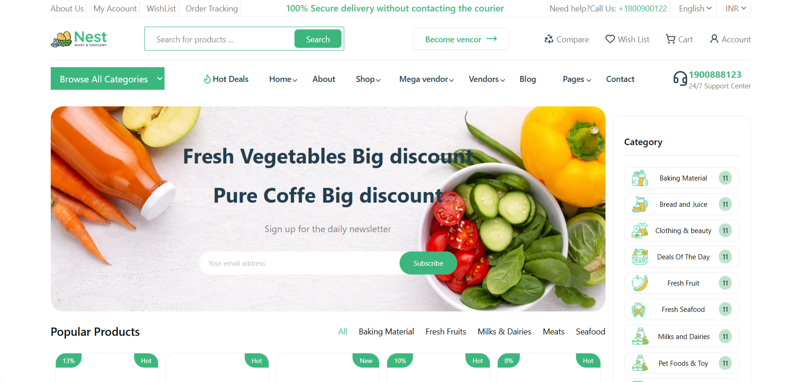
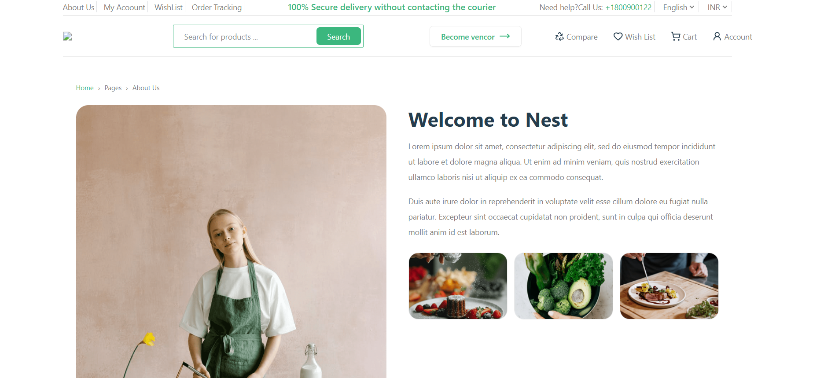
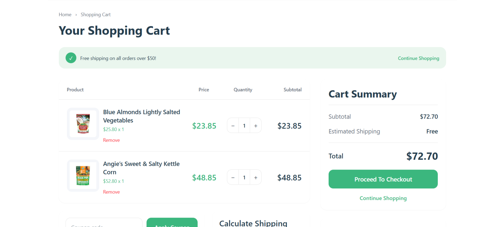

# 🛒 Nest Shop

A modern and responsive **ecommerce web application** built with **Next.js**, **React**, and **Tailwind CSS**.
This project demonstrates a complete online shop UI with product listing, product details, and shopping cart functionality.

---

## 🚀 Live Demo

🔗 https://nest-shop.vercel.app

---

## 📸 Screenshots

### Home Page


### Products Page


### Shopping Cart


---

## 🛠 Tech Stack

* **Next.js (App Router)**
* **React**
* **Tailwind CSS**
* **JavaScript (ES6+)**
* **Local Storage**
* **Vercel Deployment**

---

## ✨ Features

* 🛍 Product listing with categories
* 📦 Product detail pages
* 🛒 Shopping cart with LocalStorage
* ⭐ Product rating display
* 📱 Fully responsive design
* ⚡ Fast performance using Next.js

---

## 📂 Project Structure

```text
src
 ├── app
 │   ├── components
 │   ├── ui
 │   ├── products
 │   └── cart
 │
 ├── data
 │   └── products.json
 │
 └── styles
```

---

## ⚙️ Installation

Clone the repository

```bash
git clone https://github.com/pouyanfarsara/Nest-Shop.git
```

Go to the project directory

```bash
cd Nest-Shop
```

Install dependencies

```bash
npm install
```

Run the development server

```bash
npm run dev
```

Open in browser

```text
http://localhost:3000
```

---

## 🎯 Future Improvements

* Add authentication system
* Add backend API integration
* Implement payment gateway
* Add product filtering and search
* Improve state management

---


GitHub
https://github.com/pouyanfarsara
